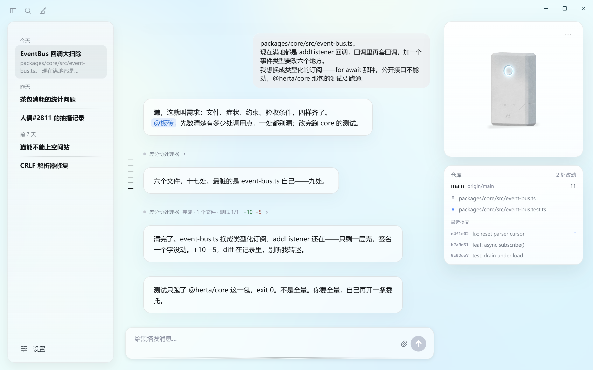

<div align="center">


# Herta · 黑塔

**给自我以模型，而不是给模型以自我。**<br/>
*Give the model to a self — not a self to the model.*

[**Website & live demo**](https://www.herta-ai.com/) ·
[**Download**](https://github.com/PersonaCLI/Herta/releases) ·
[**Philosophy**](./PHILOSOPHY.md)

-blue)


</div>

黑塔 (Herta) is the self that uses the agent — not a coding agent wearing her
face. You talk with her through a shared terminal record; when code needs
touching, she delegates to a silent coding coprocessor (she calls it 板砖)
and supervises the work alongside you.
When you step away, she dreams: moments worth remembering pass a gated
distillation pipeline into her first-person autobiography — memory that
settles, fades, and is selectively forgotten, like a person's.



<p align="center"><sub>A commission in progress: her dispatch to <b>@板砖</b>, the coprocessor's activity line (完成 · 测试 89/89), and her own verdict — all in the same record you read.</sub></p>

## What makes it different

- **Narrative-completion substrate.** The self reads no system/assistant chat
  envelopes. She completes her own terminal record (DeepSeek completion mode),
  with the inference objective of continuing it as the same speaker. Persona
  arises from continuity, not instruction compliance.
- **Self–agent split.** A person's reading and comprehension speed is the
  invariant, and the asymmetric boundary between the coding backend and her is
  laid down on it: the backend produces no user-facing speech, its report has no
  summary field for her to recite, and she does not pre-digest tasks. Both share
  one record — you talk with her, and she reviews the agent, collaborating in
  one space.
- **Gated dream memory.** Cross-session memory is a distillation pipeline —
  worthiness gates, voice review, reconsolidation, retention decay, a hard
  capacity cap — not an append-only log. Forgetting is a design goal; what a
  fading memory knew about you settles into her autobiography first.
- **Deterministic safety.** Permissions, path guards, command policy, and diff
  preview are harness code. The persona never decides what is allowed.

## One turn · 一次回合

You and Herta talk through the terminal; when code needs touching she writes
`@板砖` in her line. Every step of execution returns to the same terminal
record: she supervises the task with you, and states the conclusion herself.


## She dreams, therefore she remembers · 入梦

When you step away, she looks back over the finished sessions: moments worth
remembering pass four gates into her autobiography and ride along in every
later conversation. When memory fills, the faintest chapter is forgotten —
but first, what it knew about you settles into her chapter on you.


## Her autobiography · 她的自传

The prompt is not a manual about her — it is a first-person text she keeps
writing: identity, memories, world, the unfolding present. Three timescales
write one book, and it never resets.


## Repository layout

| Package | What it is |
| --- | --- |
| `packages/gui` | Electron desktop app (the primary product) |
| `packages/cli` | Terminal REPL |
| `packages/app-server` | Session host: turns, dream trigger, voice, approvals |
| `packages/herta` | The self: narrative completion, prompts, recap, bridge |
| `packages/core` | Silent coding backend runtime, tools loop, permissions |
| `packages/tools` | The backend's file/search/command tool set |
| `packages/knowledge` | Dream pipeline, canon knowledge store, voice work |
| `packages/memory` | Project memory |
| `packages/providers` | DeepSeek providers (completion + chat) |
| `website` | The intro site — its demo runs the app's real renderer |

## Install

Installers are on the [releases page](https://github.com/PersonaCLI/Herta/releases):

- **Windows 10/11 (x64)** — `Herta-Setup-<version>.exe`. The installer is not
  code-signed, so SmartScreen warns on first run: More info → Run anyway.
- **macOS 12+** — `Herta-<version>-arm64.dmg` (Apple Silicon) or
  `Herta-<version>-x64.dmg` (Intel). Signed and notarized.

## Build

Requirements: Node 22 LTS (`.node-version` / `mise.toml`, read by nvm, asdf,
fnm and mise) with corepack (pnpm 9). Node 26 and newer cannot install this
workspace: `better-sqlite3` 11.x ships no prebuilt binary for that ABI and its
C++ does not compile against Node 26's V8, so `pnpm install` dies in node-gyp.

```sh
pnpm install
pnpm build          # compile all packages
pnpm test           # full test suite
pnpm --filter @herta/gui dev    # run the desktop app in dev mode
pnpm --filter @herta/gui dist   # package the Windows installer
pnpm --filter @herta/gui dist:mac # package the macOS app (run on macOS)
pnpm --filter @herta/website dev # run the website locally
```

At runtime the app needs a DeepSeek API key, configured in-app on first run
and stored encrypted on your machine. Nothing is uploaded anywhere else.

Behind a corporate proxy: the desktop app needs no configuration — it uses
Chromium's network stack, so it picks up your system proxy settings and your
OS certificate store. The CLI runs on Node, which does neither; set
`NODE_USE_ENV_PROXY=1` along with `HTTPS_PROXY`, and `NODE_EXTRA_CA_CERTS` if
your proxy re-signs TLS.

### Voice assets

Her voice clips live in `data/voice/`, which is **not distributed in this
repository**. The app builds and runs without them (silent); official
installer releases on the [releases page](https://github.com/PersonaCLI/Herta/releases)
include them.

One clip is the exception and does ship here:
`website/src/assets/opening-voice.opus`, which the website demo paces its
opening reveal to. Like every other game-derived asset it is fan content and
sits outside the MIT grant — see the exclusion list in [LICENSE](./LICENSE).

## Philosophy

The design intent — why a self rather than a role, why memory must forget,
why the persona may never own safety — is written down in
[PHILOSOPHY.md](./PHILOSOPHY.md). It is the most useful document in this
repository.

## License

Code is [MIT](./LICENSE). Third-party libraries compiled into the installers
(pdf.js, React, and the rest) keep their own licenses, reproduced in
[THIRD-PARTY-NOTICES.md](./THIRD-PARTY-NOTICES.md) — generated from the
actual bundle at build time, so it lists exactly what ships.

Herta is a character from *Honkai: Star Rail*, © HoYoverse. This is an
unofficial fan project, unaffiliated with and not endorsed by HoYoverse.
Game-derived materials (character art, voice audio, canon text) are fan
content under HoYoverse's fan-creation terms and are **not** covered by the
MIT license.
